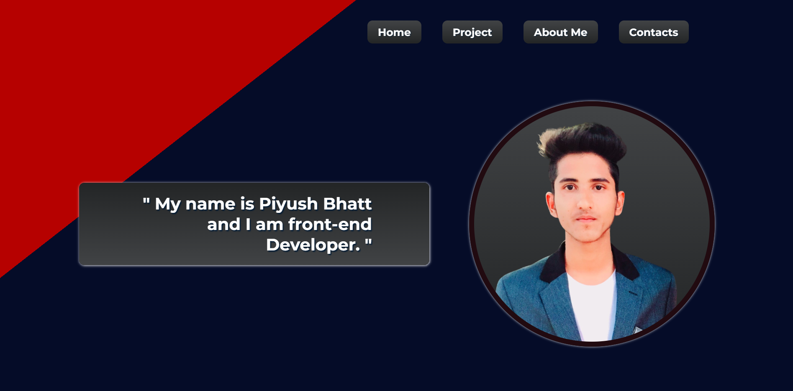

# My Portfolio - HTML and CSS

By Piyush Bhatt

Deployed link of website &nbsp; 

 

# [Link to My Portfolio](https://portfolio-web-me.netlify.app/)

 

# Preview of my Portfolio.

 

## What I learnt in this Project?

- I learned about how to make website **layout** through **flexbox.**
- I also learned how to create **stripes background.**
- I also learned to create **sticky Navbar.**
- I also learned to **add project** using anchor tag to my portfolio.
- I also learned how to play with **gradient properties.**

  

# Time Taken to complete  this project is 8 hour.